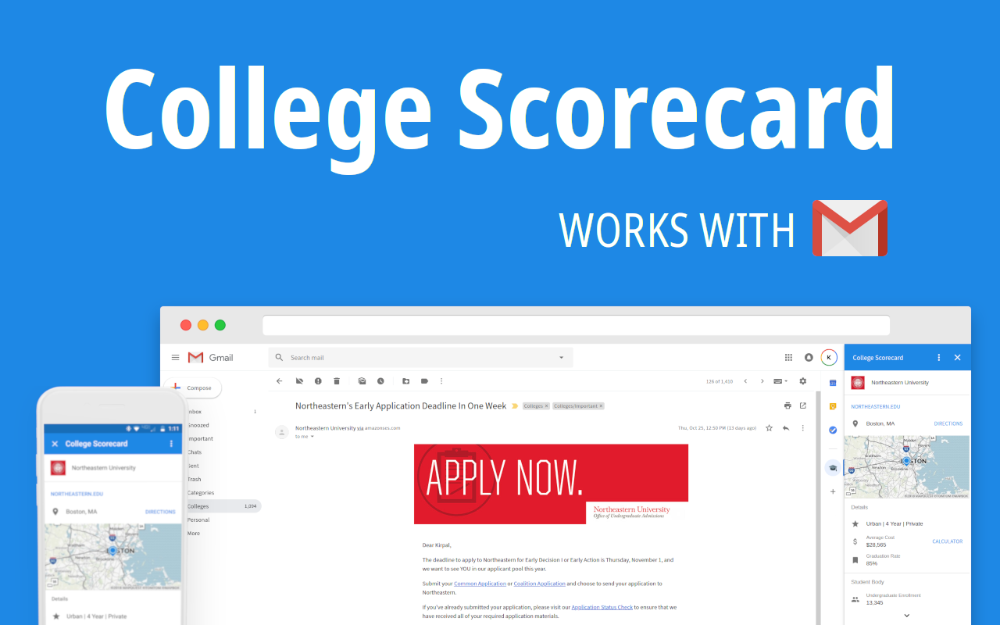

# College Scorecard Gmail Add-on

*Not on GSuite Store yet*

The College Scorecard Gmail Add-on gives you quick information about a college right from Gmail. Just click the icon while opening college emails to easily view their scorecard information. Data sourced from [College Scorecard][college_api].

## Before you begin

If you're new to add-on development or Apps Script, try the
[Google quickstart][quickstart] before proceeding.

This script requires the following:

-  [Node.js][node] is installed.
-  [`clasp`][clasp] is installed. `clasp` is a tool for managing Apps Script
   projects.

## Downloading the project

Download the add-on and navigate into the add-on directory:

1.  Clone the [add-on][github-repo] to your local
    machine:

        git clone https://github.com/kirpal/college-scorecard-gmail.git

    Alternatively, you can [download the add-on][github-zip] as a zip file and
    extract it.

2.  Change to the add-on directory:

        cd college-scorecard-gmail

3.  Initialize the project:

        npm install

## Deploy the add-on

Deploy the add-on by following these steps:

1.  Create a new project:

        clasp create "College Scorecard"

2.  Push the code:

        clasp push

4.  Tag a version:

        clasp version 'Push from github'

5.  Deploy the add-on:

        clasp deploy 1 'test'

6.  Verify the deployments:

        clasp deployments

Note the deployment ids. There will be two deployments, one for the tagged
version, another for the `@HEAD` version. Use the `@HEAD` deployment when
installing the add on if you intend to modify or experiment with the code.

## Configure API credentials

Access to the APIs requires registration. To register your own application:

1.  Open the API documentations and sign up for keys:

    * [College Data][college_api]

    * [Mapquest][mapquest_api]

2.  Create a script property with the credentials:

    a. Click on **File > Project properties > Script properties**.

	b. Click **Add row**.

	c. Enter the property name `mapquest`.

	d. Click on the blank area in the **Value** column.

	e. Enter your mapquest API key

    f. Repeat steps b - e with the property name `collegeAPI` and your college scorecard API key

	f. Click **Save**.

## Install the add-on

One the add-on is deployed, install the add-on on your account using these steps:

1.  Open the [Gmail add-on settings][gmail-settings] tab.

2.  In the **Add-ons** tab, ensure that you have selected the **Enable developer
    add-ons for my account** checkbox.

3.  Paste your add-on's deployment ID into the **Install developer add-on** textbox
    and click **Install**.

4. In the **Install developer add-on** dialog that appears, click the checkbox to
   indicate that you trust this developer (yourself), then click **Install**.

The add-on appears in the **Developer add-ons** list at this point. The
**Enable debugging information** checkbox (which is checked by default) instructs
Gmail to create and display an error report card when script or runtime errors
occur during the execution of the add-on.

## Run the add-on

1.  Open [Gmail][gmail]. If Gmail was open prior to enabling the add-on,
    you may need to refresh the tab.

2.  Open a message in Gmail.

3.  The add-on should place a contextual card on the right-side of the window,
    with a message asking for authorization. Click the **Authorize access** link
    to open a dialog where you can authorize the add-on.

4.  Select the account that should authorize the add-on.

5.  The next dialog may inform you that the app is not verified. In this case you
    can proceed by doing the following:

    a.  Click **Advanced**.

    b. At the bottom of the dialog, click **Go to College Scorecard (unsafe)**.

    c. In the new dialog, type "Continue" into the text field, then click **Next**.

6.  Read the notice in the next dialog carefully, then click **Allow**.

7.  Once authorized, the add-on should automatically refresh and start operating.

## License

This add on is licensed under the [MIT][license] license.

<!-- References -->
[quickstart]:https://developers.google.com/gmail/add-ons/guides/quickstart
[node]:https://nodejs.org/en/
[clasp]:https://github.com/google/clasp
[apps-script]: https://script.google.com
[github]: https://github.com
[github-repo]: https://github.com/kirpal/gmail-college-scorecard
[github-zip]: https://github.com/kirpal/gmail-college-scorecard/archive/master.zip
[college_api]: https://collegescorecard.ed.gov/data/documentation/
[mapquest_api]: https://developer.mapquest.com/documentation/
[license]: https://github.com/kirpal/gmail-college-scorecard/blob/master/LICENSE
[gmail-settings]: https://mail.google.com/mail/#settings/addons
[gmail]: https://mail.google.com/
